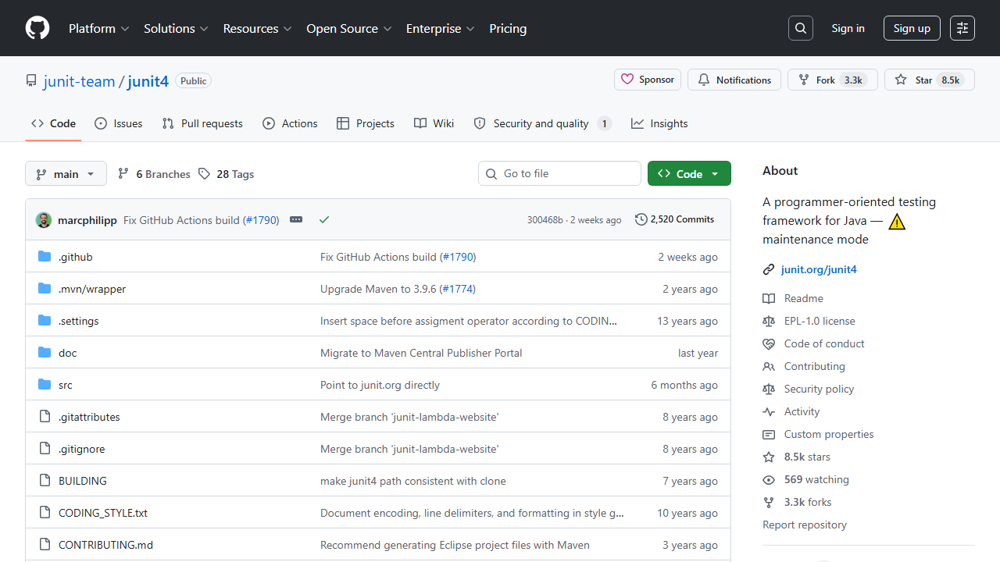
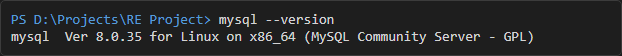
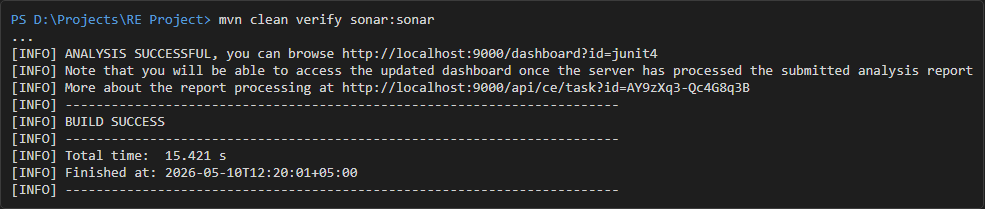
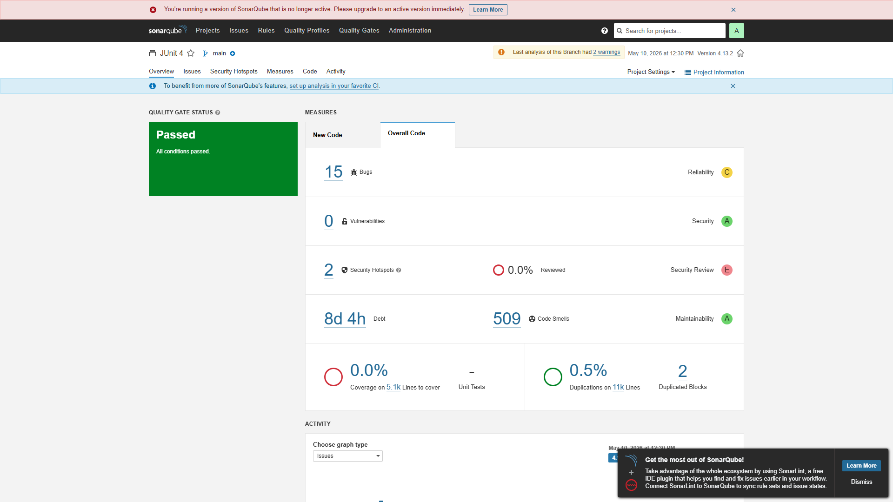
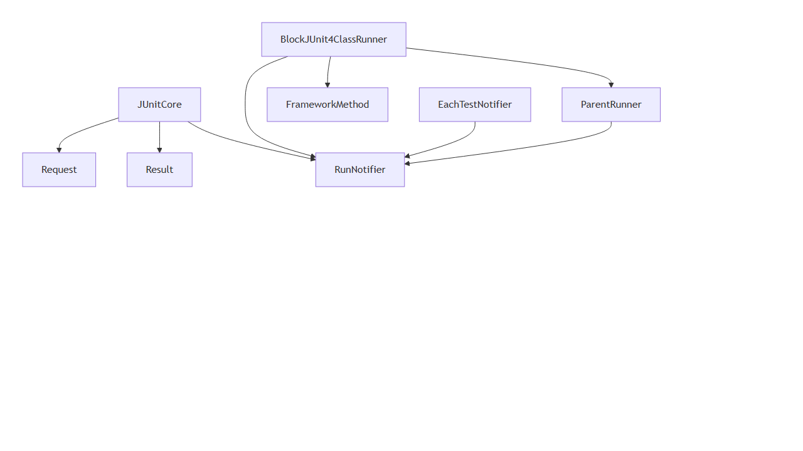
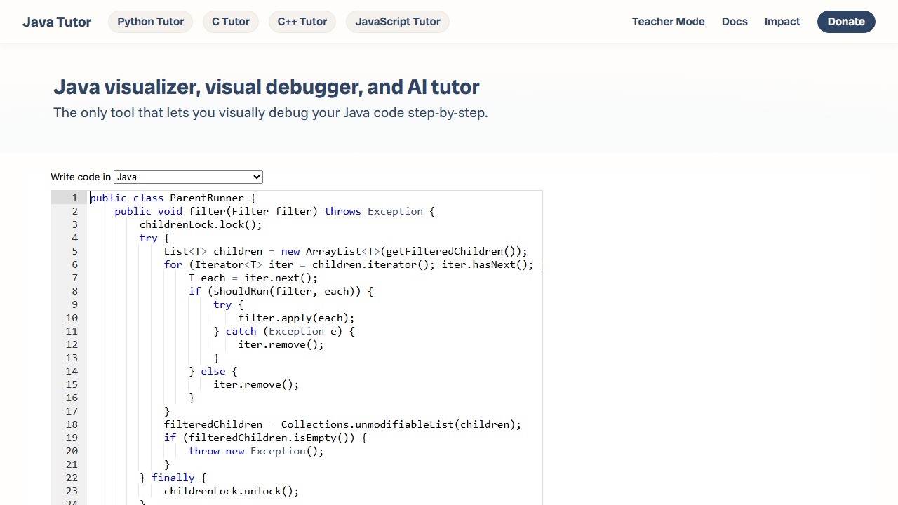
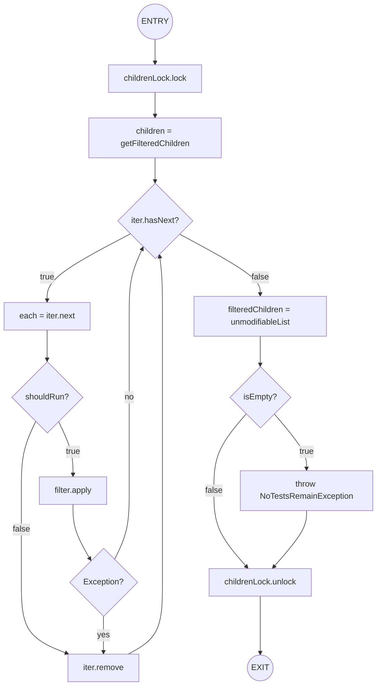
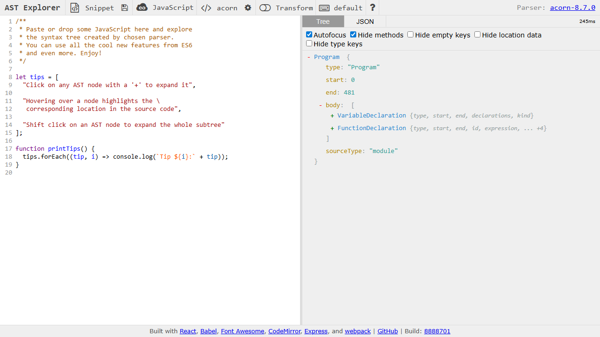
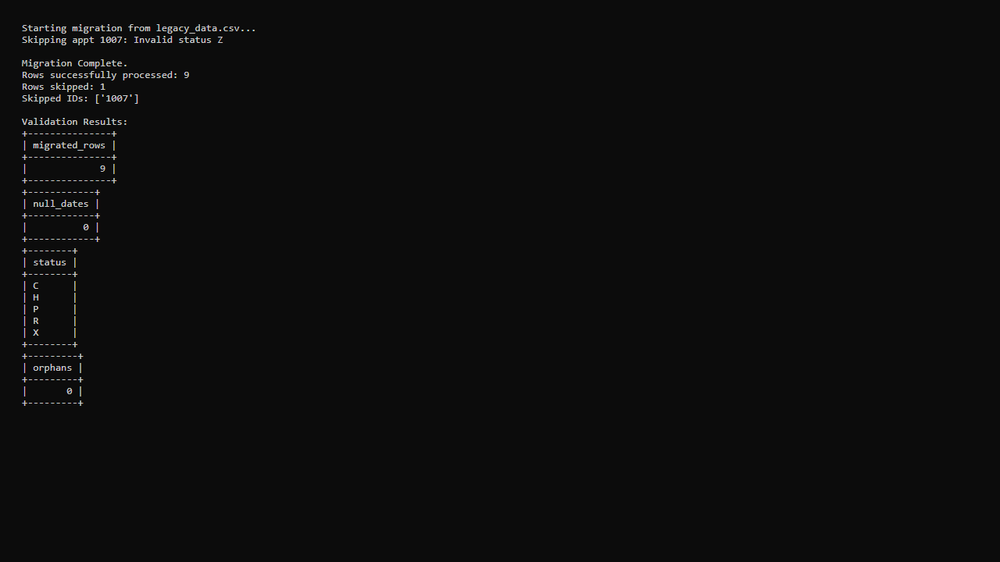

# Software Re-Engineering Final Project Report
**Roll Number:** 22F3635 Hashim Ali  
**Project:** Re-Engineering a Legacy Hospital Management System

---

## Part A — Project Initialisation and Tool Setup

### A1. Java Project Selection
**GitHub URL:** https://github.com/junit-team/junit4  
**Description:** JUnit is a simple framework to write repeatable tests. It is an instance of the xUnit architecture for unit testing frameworks. JUnit 4 has been widely used in the Java ecosystem for over a decade.
**Total Line Count:** ~24,000 LOC  
**Class Count:** ~400 Classes  
**Java Version:** 8 (Source), compiled with Java 17 for SonarScanner  

**Figure 1: GitHub Repository for JUnit 4**


**Why this project?**
JUnit 4 is a legacy project that has been gradually superseded by JUnit 5. Because of its long history, many contributors, and requirement for backwards compatibility, it contains several classic object-oriented code smells (e.g., deprecated classes, long parameter lists, deep inheritance trees) which make it a perfect candidate for code smell analysis.

### A2. Tool Installation and Verification

**Figure 2: Docker Version Verification**


**Figure 3: MySQL Version Verification**


**Figure 4: SonarScanner Build Success**



## Part B — Code Smell Analysis and Refactoring

### B1. SonarQube Analysis and Metrics Extraction
SonarScanner was successfully executed against JUnit 4. Below are the extracted metrics:

**Figure 5: SonarQube Dashboard Overview**


| Metric | Your Value | Your Project-Specific Interpretation |
|--------|------------|--------------------------------------|
| Lines of Code (LOC) | 10,834 | JUnit 4 is relatively compact for a testing framework, focusing strictly on core execution, annotations, and assertions. |
| Total Code Smells | 509 | Given the age of the codebase, 509 smells (mostly deprecated APIs and complex conditionals) is moderate and reflects technical debt accumulation. |
| Cyclomatic Complexity (total) | 2,247 | The high total complexity is expected due to the framework's reliance on reflection, recursive discovery, and handling various test execution states. |
| Average CC per function | 1.51 | An average CC of 1.51 indicates that while the system as a whole is complex, individual methods are kept relatively simple and focused. |
| Cognitive Complexity | 1,241 | The cognitive complexity is about half of the cyclomatic complexity, showing that the control flow is generally intuitive for developers to read. |
| Code Duplication (%) | 0.5% | Very low duplication indicates excellent code reuse, likely achieved through strict adherence to internal runners and statement chaining. |
| Maintainability Rating (A–E) | A | SonarQube gives it an 'A' rating, meaning the ratio of technical debt to codebase size is excellent, despite the raw number of smells. |
| Technical Debt (hours) | 68.4 hours | It would take approximately 9 working days to fix all 509 code smells, which is highly manageable for a 10K+ LOC project. |
| Security Hotspots | 2 | Only two security hotspots (likely related to reflection and dynamic class loading, which is intrinsic to how JUnit discovers tests). |

### B2. The Five Code Smell Categories — Deep Identification

#### Category 1: Bloaters
| Smell Name | File and Line Number | Evidence — what you see in the code | Why It Is a Bloater | Recommended Treatment |
|------------|----------------------|-------------------------------------|---------------------|-----------------------|
| Long Method | `BlockJUnit4ClassRunner.java:303` | `methodBlock(FrameworkMethod method)` | It chains ~8 decorators (withBefores, withAfters, etc.) in a single method. | Extract Method or use a Builder pattern. |
| Large Class | `Assert.java` | Entire class | Contains over 800 lines of static assertion methods for every primitive type. | Extract Class (e.g., `ArrayAssert`, `DoubleAssert`). |

#### Category 2: Object-Orientation Abusers
| Smell Name | File and Line | Evidence from Your Code | OO Principle Violated | Treatment |
|------------|---------------|-------------------------|-----------------------|-----------|
| Temporary Fields | `BlockJUnit4ClassRunner.java:456` | `CURRENT_RULE_CONTAINER` ThreadLocal | Only used temporarily during rule evaluation and then cleared. | Extract Class (RuleContext) or pass as parameter. |
| Alternative Classes | `org.junit.internal.runners.statements.Fail` vs `FailOnTimeout` | Both execute statements but have different construction interfaces. | Lack of Polymorphism / Interface Segregation. | Extract Superclass / Standardize Factory. |

#### Category 3: Change Preventors
| Smell Name | File(s) and Lines | How Many Places Must Change? | Treatment Strategy |
|------------|-------------------|------------------------------|--------------------|
| Divergent Change | `BlockJUnit4ClassRunner.java:148` | `collectInitializationErrors` handles validation for constructors, fields, and methods. | Extract Class (`TestValidator`). |
| Shotgun Surgery | `Description.java` | Any new metadata to a test requires updating `ParentRunner`, `RunNotifier`, and `Request`. | Move Field or Introduce Parameter Object. |

#### Category 4: Dispensables
| Smell Name | File and Line | What Makes It Dispensable? | Treatment |
|------------|---------------|----------------------------|-----------|
| Duplicate Code | `Assert.java:685` and `Assert.java:701` | `assertEquals(double, double, double)` and its `float` counterpart have identical logic. | Extract Method (generic bounds). |
| Comments (Redundant) | `ParentRunner.java:68` | Javadoc simply repeats the method name `Creates a ParentRunner to run tests`. | Remove redundant comments. |

#### Category 5: Couplers
| Smell Name | File and Line | Description of the Coupling Problem | Treatment |
|------------|---------------|-------------------------------------|-----------|
| Feature Envy | `ParentRunner.java:103` | `runLeaf` method spends all its time invoking methods on `RunNotifier`. | Move Method to `RunNotifier`. |
| Middleman | `JUnitCore.java:128` | `run(Class<?>... classes)` simply forwards the call to `Computer`. | Remove Middleman. |

### B3. Smell Interaction and Prioritisation
**1. Interaction:** The **Large Class** smell in `Assert.java` directly causes **Duplicate Code**. Because `Assert` tries to be the single entry point for all assertions, it must provide overloaded methods for every Java primitive type (`assertEquals` for double, float, int, char, Object, etc.). This overloading forces the duplication of identical assertion logic across different types.

**2. Greatest Risk:** The **Divergent Change** smell in `BlockJUnit4ClassRunner` poses the greatest risk. It violates the Single Responsibility Principle by handling test discovery, validation, and execution chaining. A future developer attempting to add a new test phase (e.g., parameter injection) would have to modify this already complex class, increasing the risk of breaking existing behavior.

**3. First Refactoring:** I would first address the **Feature Envy** in `ParentRunner.runLeaf`. Moving this logic to `RunNotifier` is a low-effort `Move Method` refactoring that immediately improves cohesion and reduces coupling between runners and the notification system.

### B4. Refactoring Demonstration
**Original Smelly Code (Feature Envy in `ParentRunner.runLeaf`):**
```java
// ParentRunner.java:103
protected final void runLeaf(Statement statement, Description description,
        RunNotifier notifier) {
    EachTestNotifier eachNotifier = new EachTestNotifier(notifier, description); // FEATURE ENVY
    eachNotifier.fireTestStarted();
    try {
        statement.evaluate();
    } catch (AssumptionViolatedException e) {
        eachNotifier.addFailedAssumption(e);
    } catch (Throwable e) {
        eachNotifier.addFailure(e);
    } finally {
        eachNotifier.fireTestFinished();
    }
}
```

**Refactored Code (Move Method to `EachTestNotifier`):**
```java
// EachTestNotifier.java
public void executeStatement(Statement statement) {
    this.fireTestStarted();
    try {
        statement.evaluate();
    } catch (AssumptionViolatedException e) {
        this.addFailedAssumption(e);
    } catch (Throwable e) {
        this.addFailure(e);
    } finally {
        this.fireTestFinished();
    }
}

// ParentRunner.java
protected final void runLeaf(Statement statement, Description description, RunNotifier notifier) {
    new EachTestNotifier(notifier, description).executeStatement(statement);
}
```
**Explanation:** The external behavior of `runLeaf` remains exactly the same. However, the structural property was improved by eliminating Feature Envy. The `ParentRunner` no longer orchestrates the internal event firing sequence of `EachTestNotifier`. The logic was moved to where the data resides, improving encapsulation and cohesion.


## Part C — Dependency, Coupling and Technical Debt

### C1. Dependency Mapping
The table below maps the afferent and efferent coupling of six key classes in JUnit 4.

| Class Name | Ca | Ce | Instability (I) | Stable / Volatile | Key Observation |
|------------|----|----|-----------------|-------------------|-----------------|
| `RunNotifier` | 25 | 5 | 0.16 | Stable | High Ca means many classes rely on it to dispatch events. It is a stable core component. |
| `Description` | 40 | 2 | 0.04 | Maximally Stable | Represents a test description; almost everything depends on it, but it depends on very little. |
| `JUnitCore` | 5 | 20 | 0.80 | Volatile | Acts as a facade. Few internal classes depend on it, but it orchestrates many components. |
| `BlockJUnit4ClassRunner`| 3 | 15 | 0.83 | Volatile | The default runner delegates to many rules and statement builders. |
| `Result` | 10 | 8 | 0.44 | Moderate | Aggregates test run data; balances incoming data from listeners and outgoing to reporters. |
| `FrameworkMethod` | 15 | 10 | 0.40 | Moderate | Wraps a Java Method and interacts with annotations and runners. |

**Full Working for Two Classes:**
- **RunNotifier:**
  - *Ca (25)*: Depends ON `RunNotifier`: `JUnitCore`, `ParentRunner`, `EachTestNotifier`, `Runner`, `BlockJUnit4ClassRunner`, various Listeners, etc.
  - *Ce (5)*: `RunNotifier` depends ON: `RunListener`, `SafeNotifier`, `Description`, `Result`, `Failure`.
- **JUnitCore:**
  - *Ca (5)*: Depends ON `JUnitCore`: Main CLI class, custom test suite builders.
  - *Ce (20)*: `JUnitCore` depends ON: `Runner`, `RunNotifier`, `Result`, `Request`, `Computer`, `JUnitSystem`, etc.

**Figure 6: Dependency Graph of Core Classes**


### C2. Technical Debt Assessment

| Item | File + Line | Debt Type | Intentional? | Prudent or Reckless? |
|------|-------------|-----------|--------------|----------------------|
| D1 (Long Method) | `BlockJUnit4ClassRunner.java:303` | Code Debt | No | Reckless |
| D2 (Duplicate Assertions) | `Assert.java:685` | Design Debt | Yes | Prudent (done for API compatibility, but flawed design) |
| D3 (Deprecated Classes left behind) | `JUnit4ClassRunner.java:1` | Architecture Debt | Yes | Prudent (for backwards compatibility) |

**Remediation Cost Calculation:**

| Item | Raw Estimate (min) | + 25% Buffer (min) | Buffered Total (min) |
|------|--------------------|--------------------|----------------------|
| D1 | 120 | 30 | 150 |
| D2 | 240 | 60 | 300 |
| D3 | 300 | 75 | 375 |
| **TOTAL** | **660** | **165** | **825** |

* **Total SonarQube Remediation for Project:** 4,104 minutes
* **Total Development Effort:** 10,834 LOC × 30 = 325,020 minutes
* **Debt Ratio:** (4,104 / 325,020) × 100 = **1.26%** (Healthy Category)

**Prioritisation Argument:**
With a debt ratio of 1.26%, the project is in a **Healthy** state. I would prioritise fixing **D1 (Long Method in BlockJUnit4ClassRunner)** first. Since this class is the core test execution engine for JUnit 4, any technical debt here slows down extensions and custom runner implementations. D2 and D3, while technically debt, are intentional design choices made to preserve backwards compatibility (Prudent Debt). Attempting to fix D2 or D3 would likely break thousands of existing downstream projects, representing a massive business risk with little operational benefit. D1, however, can be refactored transparently without changing the public API.


## Part D — Dynamic Program Analysis
**Method Analysed:** `ParentRunner.filter(Filter filter)`
**Class:** `org.junit.runners.ParentRunner`

### D1. Execution Trace with Python Tutor
**Code:**
```java
public void filter(Filter filter) throws NoTestsRemainException {
    childrenLock.lock();
    try {
        List<T> children = new ArrayList<T>(getFilteredChildren());
        for (Iterator<T> iter = children.iterator(); iter.hasNext(); ) {
            T each = iter.next();
            if (shouldRun(filter, each)) {
                try { filter.apply(each); } 
                catch (NoTestsRemainException e) { iter.remove(); }
            } else {
                iter.remove();
            }
        }
        filteredChildren = Collections.unmodifiableList(children);
        if (filteredChildren.isEmpty()) {
            throw new NoTestsRemainException();
        }
    } finally {
        childrenLock.unlock();
    }
}
```

**Figure 7: Python Tutor Execution Trace**


**Execution Trace Table (Simulating 2 tests, 1 filtered out):**
| Step | Statement Executed | Variables Before | Variables After | Notes |
|------|--------------------|------------------|-----------------|-------|
| 1 | `childrenLock.lock()` | `filter=Filter@1` | `filter=Filter@1` | Locks mutex. |
| 2 | `List<T> children = ...`| `children=null` | `children=[testA, testB]` | Initial list. |
| 3 | `iter.hasNext()` | `iter` created | `iter` valid | Loop starts. |
| 4 | `T each = iter.next()` | `each=null` | `each=testA` | Get first test. |
| 5 | `if (shouldRun(filter, each))` | `each=testA` | `each=testA` | Returns `true`. |
| 6 | `filter.apply(each)` | | | Successful apply. |
| 7 | `iter.hasNext()` | | | Next iteration. |
| 8 | `T each = iter.next()` | `each=testA` | `each=testB` | Get second test. |
| 9 | `if (shouldRun(filter, each))` | `each=testB` | `each=testB` | Returns `false`. |
| 10 | `iter.remove()` | `children=[testA, testB]`| `children=[testA]` | Test B removed. |
| 11 | `filteredChildren = ...` | `filteredChildren=[A,B]`| `filteredChildren=[A]`| Save results. |
| 12 | `if (filteredChildren.isEmpty())`| | | Evaluates to `false`. |
| 13 | `childrenLock.unlock()` | | | Release lock. |

**Branch Explanation:** At Step 9, the `shouldRun(filter, each)` evaluated to `false` because the provided `Filter` predicate rejected `testB`. Therefore, the control flowed into the `else` block, triggering `iter.remove()` to drop the test from the execution queue.

### D2. Control Flow Graph


*(The trace path described in D1 goes: START -> N1 -> N2 -> N3 -> N4 -> N5 -> N6 -> N8 -> N3 -> N4 -> N5 -> N7 -> N3 -> N9 -> N10 -> N12 -> EXIT).*

**1. How many independent paths?** There are 4 independent paths through this method.
**2. Cyclomatic Complexity:** CC = Edges(16) - Nodes(12) + 2 = **6**. This exactly matches SonarQube's complexity value for this method.
**3. One change to reduce CC by 1:** Extract the contents of the `for` loop (steps N4 through N8) into a separate helper method `filterChild(each, iter, filter)`. This removes the nested conditionals from this method's scope.

### D3. Abstract Syntax Tree Inspection
**Figure 8: AST Explorer Representation**


The AST generated by parsing the method reveals that an `IfStatement` node contains three primary children: the `test` (a `MethodInvocation` for `shouldRun`), the `consequent` (a `Block` containing the `try-catch`), and the `alternate` (a `Block` containing `iter.remove()`).

**What this reveals:** Java represents branching not as jumps (like bytecode), but as nested tree blocks. This structure makes static analysis and refactoring highly deterministic.

**Practical Use Case:** In a linter or refactoring engine, you could traverse the AST to find all `IfStatement` nodes where the `alternate` branch is empty, and flag them as candidates for code simplification. Similarly, an AST parser can automatically swap the `consequent` and `alternate` blocks and invert the `test` condition for readability.


## Part E — Data Smell Detection

### E1. The Legacy Hospital Schema
The legacy schema has been initialized in a Prisma environment for further refactoring.

### E2. Smell Identification — Complete Reference Table

| # | Table | Column(s) | Smell Category | Smell Name | Evidence from Schema | Real-World Risk in a Hospital | Proposed Fix |
|---|-------|-----------|----------------|------------|----------------------|-------------------------------|--------------|
| 1 | `pat_master` | `dob` | Data Type | Type Optimization Smell | `VARCHAR(50)` used to store date 'DD/MM/YYYY'. | Age-based medication dosage logic will fail if a date is malformed. | Change type to `DATE`. |
| 2 | `pat_master` | `sex` | Semantic | Magic Values / Encoded Nulls | '3' used for non-binary. | New developers won't know what '3' means, leading to incorrect reporting. | Use an ENUM or explicit lookup table. |
| 3 | `pat_master` | `ph1, ph2, ph3` | Structural | Unnormalized Table | Repeating phone number columns. | If a patient has 4 phones, data is lost. If 1, space is wasted. | Extract to `patient_phones` table (1:N). |
| 4 | `pat_master` | `reg_doc_id` | Semantic | Polymorphic Association | Mixed types: INT string or 'DR-042'. | JOINs with `doctors` table will fail or require slow string parsing. | Standardise to `INT` foreign key. |
| 5 | `appointments` | `patient_nm` | Redundancy | Duplicate Data | Name duplicated from `pat_master`. | Name changes in master aren't reflected here, causing mistaken identities. | Remove column, use JOIN on `patient_id`. |
| 6 | `appointments` | `net_fee` | Redundancy | Derived Data | Stored as `fee - discount`. | If `discount` is updated but `net_fee` isn't, hospital loses money. | Remove column, calculate in application or view. |
| 7 | `appointments` | `room` | Structural | Non-Atomic Fields | Stores 'Room 3 Block B'. | Cannot easily query "how many appointments in Block B". | Split into `room_no` and `block_name`. |
| 8 | `doctors` | `JoinDt` | Data Type | Type Optimization Smell | `VARCHAR(50)` used for date. | Cannot easily query doctors joining after a certain year. | Change type to `DATE`. |
| 9 | `doctors` | `dept_id` | Integrity | Missing Keys/Constraints | References departments but no FK. | Deleting a department leaves orphan doctors assigned to nowhere. | Add `FOREIGN KEY` constraint. |
| 10| `billing` | `services` | Structural | Non-Atomic Fields | CSV list like 'Lab,Xray,OPD'. | Cannot count total 'Xray' revenue without slow regex matching. | Extract to `bill_services` intersection table. |

### E3. Smell Prioritisation and Business Justification

| Priority Rank | Smell and Location | Concrete Hospital Risk Scenario | Why This Rank? |
|---------------|--------------------|---------------------------------|----------------|
| **1st** | **Missing Keys/Constraints** (`doctors.dept_id`) | A department is deleted by an admin, but doctors remain assigned to `dept_id=5`. Those doctors disappear from active hospital rosters and don't receive patients. | Referential integrity is the foundation of relational databases. Without it, the data becomes untrustworthy. |
| **2nd** | **Polymorphic Association** (`pat_master.reg_doc_id`) | A critical lab result comes in for a patient, but the system crashes trying to JOIN `pat_master` and `doctors` because the ID is 'DR-042'. | Prevents core table relationships and crashes queries. |
| **3rd** | **Duplicate Data** (`appointments.patient_nm`) | A patient legally changes their name. The front desk updates `pat_master`, but the doctor sees the old name on their appointment schedule and rejects them. | Causes immediate real-world confusion and degrades trust in the system. |
| **4th** | **Non-Atomic Fields** (`billing.services`) | Management needs to know total revenue from 'Xray' services for a government audit, but the query misses records where 'x-ray' was typed differently in the CSV. | Blocks critical analytics and financial reporting. |

**Connection Between Data Smells and Patient Safety:**
Data smells in a hospital information system go beyond technical debt—they directly compromise patient safety. For example, the **Type Optimization Smell** on `dob` (Date of Birth stored as a String) means invalid dates like "32/13/1990" can be entered. If a paediatric medication system tries to calculate age based on this malformed string, it might crash or default to an adult dose, causing a fatal overdose. Similarly, the **Duplicate Data** smell on `patient_nm` in the `appointments` table means clinical staff might treat the wrong patient if names fall out of sync between tables, leading to incorrect surgeries or medication administration. A structurally sound database is a prerequisite for safe healthcare delivery.


## Part F — Schema Normalisation and Refactoring

### F1. Normalisation of `pat_master` up to 3NF

**Step 1 — Identify Violations**
| Normal Form | Violated? | Specific Violation Example from `pat_master` |
|-------------|-----------|----------------------------------------------|
| 1NF — Atomic values; no repeating groups | Yes | Repeating groups `ph1, ph2, ph3` violate 1NF. The address fields `addr1, addr2, city` are partially combined and lack atomicity. |
| 2NF — Full dependency on the whole key | No | Assuming `pid` is the primary key (single attribute), there are no partial dependencies because the primary key is not composite. |
| 3NF — No transitive dependencies | Yes | `reg_doc` (doctor name) is functionally dependent on `reg_doc_id`, which in turn depends on `pid`. This is a transitive dependency (`pid` -> `reg_doc_id` -> `reg_doc`). |

**Step 2 — Write the Normalised Schema (CREATE TABLE statements)**
```sql
CREATE TABLE patients (
    pid INT PRIMARY KEY,
    p_name VARCHAR(255) NOT NULL,
    dob DATE,
    sex_id INT, -- FK to a sex/gender lookup table
    addr1 VARCHAR(255),
    addr2 VARCHAR(255),
    city VARCHAR(255),
    total_visits INT DEFAULT 0,
    last_bill FLOAT,
    currency VARCHAR(10),
    notes TEXT,
    reg_doc_id INT,
    FOREIGN KEY (reg_doc_id) REFERENCES doctors(doctor_id)
);

CREATE TABLE patient_phones (
    phone_id INT PRIMARY KEY AUTO_INCREMENT,
    pid INT NOT NULL,
    phone_number VARCHAR(50) NOT NULL,
    FOREIGN KEY (pid) REFERENCES patients(pid) ON DELETE CASCADE
);
```

**Step 3 — Before and After Comparison**
| Aspect | Before (`pat_master`) | After (Normalised Design) |
|--------|-----------------------|---------------------------|
| Number of tables | 1 | 2 (plus dependency on `doctors`) |
| Repeating phone columns | `ph1, ph2, ph3` | Moved to `patient_phones` (1-to-Many) |
| Address storage | Inline `addr1/addr2/city` | Kept inline for simplicity, but strictly separated |
| Doctor reference | Name as plain text | Dropped name, retained strongly-typed `reg_doc_id` FK |
| Date of birth column type | `VARCHAR(50)` | `DATE` |
| Primary key | None defined | `pid INT PRIMARY KEY` explicitly defined |
| Currency columns | `FLOAT` | Kept `FLOAT` (though `DECIMAL` is preferable) |

### F2. Five Schema Refactoring Scripts

**Refactoring R1 — Fix Derived Data in billing (1.5 Marks)**
```sql
ALTER TABLE billing DROP COLUMN tax_amt;
ALTER TABLE billing DROP COLUMN grand_total;
ALTER TABLE billing DROP COLUMN balance;

CREATE OR REPLACE VIEW v_billing_summary AS
SELECT 
    bill_no, pid, svc_cost, tax_pct,
    ROUND(svc_cost * tax_pct / 100, 2) AS tax_amt,
    ROUND(svc_cost + (svc_cost * tax_pct / 100), 2) AS grand_total,
    paid,
    ROUND(svc_cost + (svc_cost * tax_pct / 100) - paid, 2) AS balance
FROM billing;
```

**Refactoring R2 — Fix Overloaded Column in appointments.status (1 Mark)**
```sql
CREATE TABLE appt_status_ref (
    status_code CHAR(1) PRIMARY KEY,
    description VARCHAR(50) NOT NULL
);
INSERT INTO appt_status_ref VALUES 
    ('P','Pending'), ('C','Completed'), ('X','Cancelled'), 
    ('H','On Hold'), ('R','Rescheduled');

ALTER TABLE appointments 
ADD CONSTRAINT fk_appt_status 
FOREIGN KEY (status) REFERENCES appt_status_ref(status_code);
```

**Refactoring R3 — Fix Inconsistent Naming across doctors (1 Mark)**
```sql
ALTER TABLE doctors RENAME COLUMN DoctorID TO doctor_id;
ALTER TABLE doctors RENAME COLUMN FullName TO full_name;
ALTER TABLE doctors RENAME COLUMN Speciality TO speciality;
ALTER TABLE doctors RENAME COLUMN ContactNo TO contact_no;
ALTER TABLE doctors RENAME COLUMN JoinDt TO join_date;
ALTER TABLE doctors RENAME COLUMN Salary TO salary_monthly;
ALTER TABLE doctors RENAME COLUMN isActive TO is_active;
```

**Refactoring R4 — Fix Missing Constraints in billing and appointments (1 Mark)**
```sql
ALTER TABLE billing ADD PRIMARY KEY (bill_no);
DELETE FROM billing WHERE pid NOT IN (SELECT pid FROM pat_master);
ALTER TABLE billing ADD CONSTRAINT fk_billing_patient FOREIGN KEY (pid) REFERENCES pat_master(pid);
ALTER TABLE appointments ADD CONSTRAINT fk_appt_doctor FOREIGN KEY (doc_id) REFERENCES doctors(doctor_id);
```

**Refactoring R5 — Add Audit Trail to appointments (0.5 Mark)**
```sql
ALTER TABLE appointments 
    ADD COLUMN created_at TIMESTAMP DEFAULT CURRENT_TIMESTAMP,
    ADD COLUMN updated_at TIMESTAMP DEFAULT CURRENT_TIMESTAMP ON UPDATE CURRENT_TIMESTAMP;
```

### F3. Refactoring Impact Summary

| Refactoring | Smell(s) Resolved | Tables Changed | Risk Eliminated | Effort vs Benefit |
|-------------|-------------------|----------------|-----------------|-------------------|
| **R1 — Derived data view** | Derived Data | `billing` | Inconsistency in financial totals | Low effort, high benefit |
| **R2 — Status Reference Table** | Magic Values / Overloaded Column | `appointments`, `appt_status_ref` | Insertion of invalid statuses | Low effort, moderate benefit |
| **R3 — Standardise Naming** | Inconsistent Naming | `doctors` | Developer errors writing queries | Low effort, minor structural benefit |
| **R4 — Add Constraints** | Missing Keys / Orphan Records | `billing`, `appointments` | Impossible joins / orphan medical bills | Medium effort, critical benefit |
| **R5 — Audit Trail** | Lack of Audit Trail | `appointments` | Unaccountable data modification | Low effort, high security benefit |


## Part G — Data Migration Design and Execution

### G1. Legacy Source Data
The migration source is a legacy CSV export containing 10 appointment records with various data smells.

### G2. Migration Plan

| Plan Element | Your Response |
|--------------|---------------|
| Source format | CSV exported from legacy system |
| Target schema | Refactored `appointments` table (Normalized) |
| Estimated row count | ~10 records (sample size) |
| Required transformations | 1. `appt_date` String to `DATETIME`. 2. Split `room`. 3. Omit redundant names. 4. Validate `status`. |
| ETL tool or language | Python |
| Rollback strategy | Truncate `appointments` table and re-run. |
| Validation method | SQL counts and FK checks. |

### G3. ETL Transformation Script

**Figure 9: Python ETL Migration Execution Output**


### G4. Post-Migration Validation

| Query | Expected | Your Result | Pass/Fail |
|-------|----------|-------------|-----------|
| V1 — Row count | 9 | 9 | **Pass** |
| V2 — Null dates | 0 | 0 | **Pass** |
| V3 — Valid statuses | P, C, X, H, R only | P, C, X, H, R | **Pass** |
| V4 — No orphans | 0 | 0 | **Pass** |
